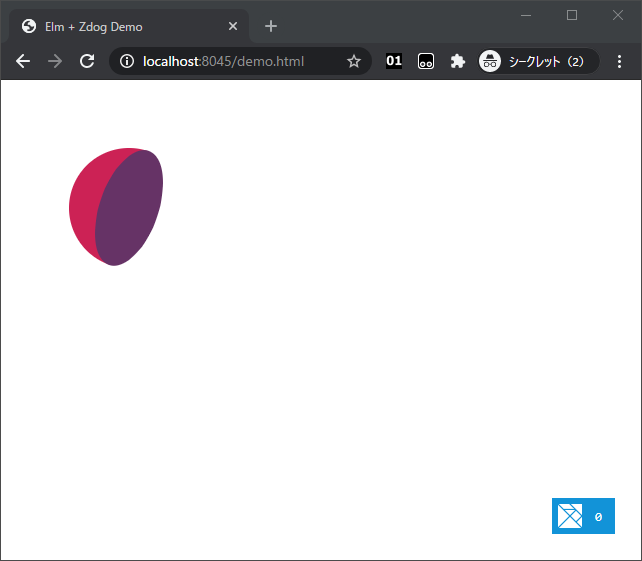

# elm-zdog

Functional interface (through ports) for [Zdog][zdog], designed for [Elm][elm]




## Alert

This is a port module, which you cannot install via `elm install`.

You need to include entire source code and build it yourself.

Currently it assume that you have global `Zdog` object at runtime.


## Usage

`index.html`:

```html
<!-- import Zdog somehow -->
<script src="https://unpkg.com/zdog@1/dist/zdog.dist.min.js"></script>
<!-- import ports *BEFORE* Elm -->
<script src="./boilerplate/setup.js"></script>
<!-- then, import Elm -->
<script src="elm.js"></script>

<!-- initialization -->
<script>
  window.addEventListener('DOMContentLoaded', () => {
    const app = Elm.Demo.init({
      node: document.getElementById('app')
    })

    // Add subscription to your program
    Zdog.installToElm(app)
  })
</script>
```


in Elm:

```elm
module Demo exposing (..)

import Browser
import Html
import Zdog exposing (defaultZdog)
import Zdog.Shape as Shape
import Zdog.Properties exposing (..)


main : Program () () ()
main =
    Browser.element
        { init = init
        , view = always (Html.text "")
        , update = \_ model -> ( model, Cmd.none )
        , subscriptions = always Sub.none
        }


init : () -> ( (), Cmd msg )
init =
    always <|
        ( ()
        , Zdog.illo
            { defaultZdog
                | model = dome -- how to draw a tangram?
                , dragRotate = True
            }
        )


dome : List Shape.Model
dome =
    [ Shape.hemisphere
        [ diameter 120
        , enableStroke False
        , color "#C25"
        , backface "#636"
        ]
    ]
```

See `./boilerplate/setup.js` to how it works.


## Compile demo

```sh
elm make --output demo.js ./examples/src/Demo.elm
```

Then open `demo.html`.


## License

MIT


[zdog]: https://zzz.dog/
[elm]: https://elm-lang.org/